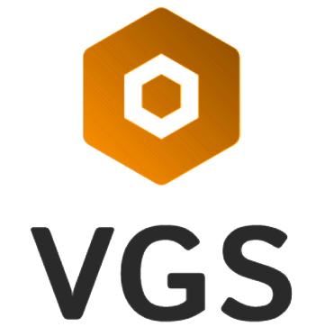

# VGS-Projeto-02

VGS (Veículos Gerenciados por um Sistema) é um projeto de gerenciamento e aluguel de veículos apresentado à disciplina de Laboratório de Desenvolvimento de Software do curso de Engenharia de Software.

## Integrantes:
- Andre Rodrigues de Freitas Faria
- Carlos Emanuel Silva e Melo Oliveira
- Gustavo Andrade Alve
- Leticia Teixeira Lott Carvalho
- Yan Rodrigues Nalon

## Professora
- Aline de Brito

