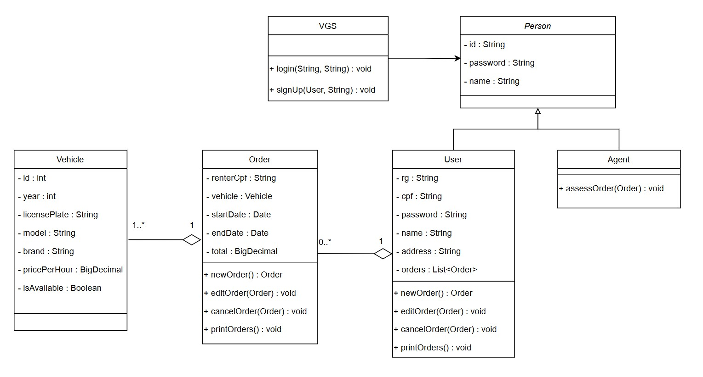

# Descrição do sistema
  
Pretende-se desenvolver um sistema para apoio à gestão de aluguéis de automóveis que permita efetuar, cancelar e modificar pedidos através da Internet. Após a análise inicial de requisitos do sistema foram levantadas as seguintes informações:

O sistema só pode ser utilizado após cadastro prévio.

Os usuários individuais (clientes) podem introduzir, modificar, consultar e cancelar pedidos de aluguel. Por outro lado, os agentes (empresas e bancos) podem modificar e avaliar pedidos.

Após introdução no sistema, os pedidos são analisados do ponto de vista financeiro pelos agentes e, em caso de parecer positivo, são colocados à sua consideração para execução do contrato.

Sobre os contratantes do aluguel, armazenam-se os dados de identificação (RG, CPF, Nome, Endereço), profissão, as entidades empregadoras e os respectivos rendimentos auferidos (máximo 3).

Dependendo do tipo de contrato, os automóveis alugados podem ser registrados como propriedade dos clientes, empresas ou bancos.

Sobre os automóveis, o sistema registra a matrícula, ano, marca, modelo e placa.

O aluguel de um automóvel pode estar associado com um contrato de crédito, o qual foi concedido por um dos bancos agentes. 

Em termos do sistema, o servidor central encontra-se ligado aos computadores locais dos clientes e aos diversos agentes aderentes através da Internet.

O sistema pode ser subdividido em dois subsistemas: um para gestão de pedidos e contratos; e outro para a construção dinâmica das páginas web.

## Histórias de Usuário
- Eu, como **usuário do sistema**, gostaria de criar uma conta e logar no sistema para proteger meus dados pessoais.
- Eu, como **usuário do sistema**, gostaria de elaborar e enviar pedidos de aluguel, permitindo-me alugar um veículo.
- Eu, como **usuário do sistema**, gostaria de editar meus pedidos já enviados para corrigir ou alterar informações conforme necessário.
- Eu, como **usuário do sistema**, gostaria de cancelar pedidos já enviados caso eu desista de realizá-lo.
- Eu, como **agente do sistema**, gostaria de visualizar novos pedidos de aluguel recebidos para que eu possa avaliá-los.
- Eu, como **agente do sistema**, gostaria de aprovar ou recusar, conforme meu julgamento, pedidos de alugle recebidos.

## Diagramas
### Diagrama de Casos de Uso

### Diagrama de Classes

